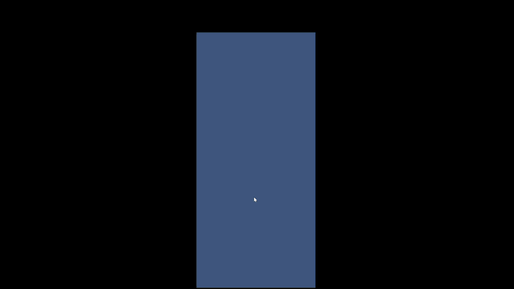

# Matchtoria

> A *Royal Match*-style match / blast puzzle prototype. Unity 6 + URP 17.2 + DOTween + UniTask. The **shareable subset** of a Dream Games case-study project — contains the Unity project skeleton (scenes, prefabs, level data, settings) and the architecture documentation; the sprite kit and internal notes are not shipped.


---

## 🎬 Gameplay Showcase

<p align="center">
  
</p>

<p align="center">
  <sub>Rocket · TNT · ColorBomb · Combos in a single flow — <code>docs/media/match3-demo.gif</code></sub>
</p>

A single mini level demonstrating how four mechanics share **one pipeline**: Rocket sweeping a row/column, TNT detonating a 5×5 area, ColorBomb clearing all tiles of a chosen color, and special-tile combos (R+T, T+T, R+R, ColorBomb+special) sequenced in parallel inside a single DOTween `Sequence`.

The design's bet: **as visual complexity grows, code stays simple**. The model layer returns a `List<Command>`; everything else is solved by timestamps and `Sequence.Insert`.

> ⚠️ **The sprite kit is not shipped.** The tiles, obstacles, UI elements and background sprites visible in the demo **belong to Dream Games** and are not included in this repository for copyright reasons. When you open the project locally you will see broken sprite references in prefabs (`MissingReference` or magenta-tile warnings) — substitute your own sprite kit or placeholder assets. The code itself runs fine.

---

## Table of Contents

1. [Architecture Overview](#architecture-overview)
2. [Scene Flow](#scene-flow)
3. [Bootstrap Layer & Singletons](#bootstrap-layer--singletons)
4. [Level Scene Lifecycle](#level-scene-lifecycle)
5. [Level, Requirements and Win/Lose](#level-requirements-and-winlose)
6. [BoardManager — The Bridge](#boardmanager--the-bridge)
7. [Model Layer](#model-layer)
8. [Command Pipeline](#command-pipeline)
9. [View Layer](#view-layer)
10. [Object Pooling](#object-pooling)
11. [Event Flow](#event-flow)
12. [Level Schema](#level-schema)
13. [Quick Start](#quick-start)
14. [Project Layout](#project-layout)
15. [Dependencies](#dependencies)
16. [Design Notes](#design-notes)
17. [License and Attribution](#license-and-attribution)

---

## Architecture Overview

The project is organised as three concentric rings:

```
  ┌─────────────────────────────────────────────────────────────────┐
  │  ① Bootstrap Layer  — DontDestroyOnLoad singletons              │
  │     GameInitiator · PlayerDataManager · LevelLoader · SceneLoader│
  │  ┌───────────────────────────────────────────────────────────┐  │
  │  │  ② Scene-Lifetime Layer  — Composition root per level     │  │
  │  │     LevelSceneManager (Awake() wires everything)          │  │
  │  │     LevelUIManager · LevelManager · Level · BoardBuilder  │  │
  │  │  ┌─────────────────────────────────────────────────────┐  │  │
  │  │  │  ③ Board Core  — Model / Command / View              │  │  │
  │  │  │     BoardManager (bridge)                            │  │  │
  │  │  │       ├─ BoardModel  (pure C#, zero Unity deps)      │  │  │
  │  │  │       ├─ BoardView   (DOTween Sequence)              │  │  │
  │  │  │       └─ BoardPoolManager (Unity ObjectPool<TileView>)│  │  │
  │  │  └─────────────────────────────────────────────────────┘  │  │
  │  └───────────────────────────────────────────────────────────┘  │
  └─────────────────────────────────────────────────────────────────┘
```

**Lifetime shrinks from outside in.** Bootstrap singletons live for the whole game session, scene-lifetime objects are rebuilt every level, and the board core is reconstructed from scratch on each `BuildBoard(LevelData)` call.

**Dependencies flow inward, with minimal horizontal coupling between systems.** The model knows nothing. The view consumes the model's `Command` output. Scene-lifetime managers wire model and view together. Bootstrap singletons concern themselves only with persistent state (current level, scene loading) — they have no opinion about gameplay rules.

---

## Scene Flow

```
┌──────────────────┐   additive    ┌──────────────────┐   additive    ┌──────────────────┐
│  Bootstrap.unity │ ────────────► │ MainMenuScene    │ ────────────► │ LevelScene       │
│  (entry point)   │  load+unload  │  (level select)  │  load+unload  │  (gameplay)      │
└──────────────────┘               └──────────────────┘               └──────────────────┘
        │                                                                      ▲
        │ DontDestroyOnLoad                                                    │
        ▼                                                                      │
  GameInitiator                                                                │
  PlayerDataManager  ────────────  CurrentLevel (JSON) ───────────────────────  ┘
  LevelLoader                                                  
  SceneLoader
```
---

## Bootstrap Layer & Singletons

`Bootstrap.unity` is the game's single entry point. The three singletons living inside it are protected for the whole session via `DontDestroyOnLoad`:

### `GameInitiator : MonoBehaviour`
Startup orchestration. `Awake()` places it on DontDestroyOnLoad and walks through splash logo → main menu.

### `PlayerDataManager` (singleton)
Persistent player state:
- `CurrentLevel: int` — the level number to be played next
- `MaxLevel: int` — highest level unlocked
- `isMaxLevelReached: bool`
- `CompleteLevel()` — bumps `CurrentLevel`, triggers `Save()`
- `Load()` — restores state from `PlayerPrefs`

### `LevelLoader` (singleton)
- `LoadLevelData(int levelNumber) → LevelData` — loads and deserializes `Resources/Levels/Level{N}.json` using Newtonsoft JSON. Storing levels as lightweight JSON data instead of separate scene/prefab assets reduces build size and keeps level content easier to scale and maintain.

`SceneLoader` is a persistent bootstrap-level singleton responsible only for scene transitions and tracking global application flow. It owns no gameplay rules or scene-specific logic.

These systems define how the application starts, transitions between scenes, and loads levels, while gameplay logic (board state, rules, requirements, win conditions, etc.) remains entirely independent from them.

---

## Level Scene Lifecycle

When `LevelScene` loads, `LevelSceneManager.Awake()` acts as **the single composition root** — it builds every level-scoped object in order and wires the events:

```csharp
private void Awake()
{
    // 1. Data
    int currentLevel = PlayerDataManager.Instance.CurrentLevel;
    LevelData levelData = LevelLoader.Instance.LoadLevelData(currentLevel);

    // 2. Logic
    m_LevelManager = new LevelManager();
    m_LevelManager.StartLevel(levelData);
    m_BoardPoolManager = new BoardPoolManager(prefabs, levelData);

    // 3. Systems
    m_LevelUIManager = Instantiate(m_LevelUIManagerPrefab);
    m_LevelUIManager.Initialize(level.Requirements, level.RemainingMoves);
    m_BoardManager = Instantiate(m_BoardManagerPrefab);
    _boardView = Instantiate(m_BoardViewPrefab);
    _boardBuilder = Instantiate(_boardBuilderPrefab);
    _boardBuilder.BuildBoard(_boardView, levelData.grid_width, levelData.grid_height);

    AdjustCamera(levelData.grid_width, levelData.grid_height);  // Royal Match-style fit-to-width

    m_BoardManager.Initialize(levelData, _boardView, m_BoardPoolManager);

    // 4. Event wiring
    level.OnMovesChanged       += m_LevelUIManager.HandleMovesChanged;
    level.OnRequirementChanged += m_LevelUIManager.HandleRequirementChanged;
    m_BoardManager.OnSwapCompleted  += level.ConsumeMove;
    m_BoardManager.OnTilesDestroyed += HandleTilesDestroyed;
    m_BoardManager.OnBoardSettled   += level.CheckGameEnd;
    level.OnLevelWon  += HandleLevelWon;
    level.OnLevelLost += HandleLevelLost;
}
```

**Pool prefabs are injected via the Inspector:** `PoolPrefabEntry[] prefabEntries` (struct: `PoolType type; TileView prefab`) → `Dictionary<PoolType, TileView>` → passed to the `BoardPoolManager` constructor.

**Camera & background:** `AdjustCamera` fits the board width to the screen width (the Royal Match pattern), and `FitBackgroundToCamera` scales the background sprite to fully cover the orthographic view.

`OnDestroy()` unsubscribes every event in the same order — no leaks.

---

## Level, Requirements and Win/Lose

`Level` (a pure C# data class):

| Field | Meaning |
|---|---|
| `LevelNumber` | Level identifier |
| `RemainingMoves` | Remaining move budget |
| `Requirements: IReadOnlyDictionary<TargetType, int>` | "Destroy this many X" goal counters |
| `m_ActiveRequirementCount` | Number of requirements still > 0 — enables O(1) win check |

| Event | Raised by | Subscriber |
|---|---|---|
| `OnMovesChanged(int remaining)` | `ConsumeMove()` | `LevelUIManager.HandleMovesChanged` |
| `OnRequirementChanged(type, remaining)` | `UpdateRequirement(type, amount)` | `LevelUIManager.HandleRequirementChanged` |
| `OnLevelWon` | `CheckGameEnd()` if no active requirements remain | `LevelSceneManager.HandleLevelWon` |
| `OnLevelLost` | `CheckGameEnd()` if moves are zero with requirements remaining | `LevelSceneManager.HandleLevelLost` |

---

## BoardManager — The Bridge

`BoardManager : MonoBehaviour` holds the Model + View + Pool triple in one place and bridges player input with the pipeline.

```
[player click] → BoardView.OnTileClicked
                 → BoardManager.HandleTileClicked(Vector2Int)
                    ├─ IsBusy?  yes → ignore
                    ├─ _firstSelection null → store, return
                    ├─ adjacency check
                    └─ BoardModel.ProcessSwap(a, b) : SwapResult
                          ├─ Commands.Count == 0 → ignore
                          ├─ real match? (not just Swap + Swap-back)
                          │   yes → OnSwapCompleted (triggers Level.ConsumeMove)
                          └─ BoardView.ExecuteCommands(commands, timedCallbacks, onComplete)
                              onComplete: OnBoardSettled → Level.CheckGameEnd
```

**Timed destroy callbacks:** `BoardManager.BuildDestroyCallbacks` maps every `DestroySelf` command to a `TargetType` and **groups them by timestamp**. If 4 reds and 2 boxes vanish at the same time, the view fires a single `OnTilesDestroyed(Dictionary<TargetType,int>)` event at that timestamp → `LevelSceneManager.HandleTilesDestroyed` updates the requirement dictionary in a batch.

`BoardManager` events:
- `event Action OnSwapCompleted` — fired the moment a real match is detected, without waiting for the animation
- `event Action<Dictionary<TargetType,int>> OnTilesDestroyed` — timed, batched
- `event Action OnBoardSettled` — fires when the view's sequence has fully completed

---

## Model Layer

> **Pure C#, zero Unity dependencies.** Pure-logic unit tests can run without launching the Unity Editor.

### Ability Interfaces (Favoring Composition Over Inheritance - Obeying Liskov's Rule)

```
IMatchable     — IsMatched, MarkAsMatched()
IMovable       — IsMoving
IDamagable     — Health, TakeDamage(int), GetDamageEffect()
ITriggerable   — GetTriggerEffect() : Damage
IPoolable      — Init(), Activate(), get_tag()           (view-side)
IAnimateDamage / IAnimateDestroy / IAnimateSpawn / IAnimateTrigger   (view-side)
```

Each tile **only implements the interfaces it actually supports**, so trying to damage a `Rocket` (which is not `IDamagable`) is a compile-time error, not a runtime one.

### `TileModel` Hierarchy (abstract)

| Tile | Interfaces | Behaviour |
|---|---|---|
| `Matchable` | `IMatchable`, `IMovable`, `IDamagable` | Coloured tile (R/G/B/Y) — destroyed by a 3+ match or by adjacent damage |
| `Box` | `IDamagable` | Static, only destroyed by adjacent damage |
| `Vase` | `IDamagable` | Multi-hit obstacle (2 hits) |
| `Stone` | `IDamagable` | Multi-hit, tougher variant |
| `Rocket` (horizontal/vertical) | `ITriggerable`, `IMovable`, `IDamagable` | Sweeps a row or column when triggered |
| `TNT` | `ITriggerable`, `IMovable`, `IDamagable` | Detonates a 5×5 area |
| `ColorBomb` | `ITriggerable`, `IMovable`, `IDamagable` | Clears all tiles of a chosen colour across the whole board |

`TileModel.GetDeathEffect() : Damage` — the side-effect a tile emits as it dies (if any).

### Enums

```
TileType    : None, Red, Green, Blue, Yellow, Purple, Rock,
              VerticalRocket, HorizontalRocket, TNT, ColorBomb,
              Vase, Stone, Box
NodeLayer   : None=-1, Top=0, Middle=1, Bottom=2
TileStatus  : Unaffected, Alive, Destroyed
TargetType  : (requirement bucket — color + obstacle mappings)
PoolType    : None, Matchable, Rock, VerticalRocket, HorizontalRocket,
              TNT, ColorBomb, Vase, Stone, Box
```

### `NodeModel` — three-layer cell

Each grid cell holds **three tile slots**, not one (`m_Layers: TileModel[3]`):

| Layer | Typical content |
|---|---|
| **Top** | Overlay obstacle, decoration on top |
| **Middle** | Movable tile — `Matchable`, `Rocket`, `TNT`, `ColorBomb` |
| **Bottom** | Under-tile obstacle, floor |

API:

```csharp
GetLayer(NodeLayer) : TileModel
SetLayer(NodeLayer, TileModel)
DamageLayer(NodeLayer, int dmg) : Damage         // damage a single layer
DamageLayersWith(TileType, int dmg) : Damage     // damage whichever layer matches
TriggerLayer(NodeLayer) : Damage                 // trigger a special tile
FallTile() : TileModel                           // the tile in this cell that can fall
IsTileMovable() : bool
ResolveEffect(...) : Damage                      // layer-aware composition
```

### `BoardModel` — the orchestrator

| Method | Job |
|---|---|
| `BuildBoard(LevelData)` | Build the grid from scratch |
| `ProcessSwap(pos1, pos2) : SwapResult` | Swap two tiles → run the match cascade → return the full command list |
| `ProcessCascade() : List<Command>` | Loop match → damage → fall → spawn until no matches remain |
| `ProcessTriggerCombination(...)` | Two special tiles swapped → combo damage |
| `SpawnSpecialTiles(MatchResult)` | 4-match → Rocket · L/T/+ → TNT · 5+ → ColorBomb |
| `MarkMatchedTiles(MatchResult)` | Flag matched cells via `IMatchable.MarkAsMatched` |
| `CollectTriggerIfExists(pos) : Damage` | If a triggerable tile lives at `pos`, collect its damage delegate |

### `MatchManager` (utility)

**Priority order — a bigger match consumes the smaller one:**

```
  FindColorBombMatches    (5+ in a straight line)
       ↓
  FindTNTMatches          (L / T / + shape)
       ↓
  FindRocketMatches       (4 in a straight line)
       ↓
  RemainderCleanup        (remaining 3-matches)
```

Two entry points:
- `FindMatches(NodeLayer, board)` — full scan, intersection of `HorizontalMatchFinder` and `VerticalMatchFinder`
- `FindMatchesAfterSwap(...)` — fast path, scans only the row/column pair affected by the swap

Output: `MatchResult { matches, specialTileTypes, specialTilePositions }`.

### `FallManager` (utility)

A single `FallIteration(board, ts, fallTime)`:

1. **Straight fall** — for an empty cell, drop the tile directly above (y+1)
2. **Up-right diagonal** — if straight is blocked, source from the upper-right
3. **Up-left diagonal** — if that's also blocked, source from the upper-left
4. **Spawn** — empties in the top row are filled by `TileFactory.CreateTile("random")`, emitting a `Spawn` command that carries its colour

`Fall(board, ts)` repeats the iteration **until no tile fell during a tick**, advancing the timestamp by `FALL_TIME` each round.

### `DamagePatterns` (static)

Every special tile is just a `Damage` delegate:

```csharp
delegate List<Command> Damage(Vector2Int pos, int dmg, NodeModel[,] board, float ts);
```

The catalogue:

| Pattern | Behaviour |
|---|---|
| `HorizontalRocketDamage` | Sweeps the row (parallel left + right waves) |
| `VerticalRocketDamage` | Sweeps the column |
| `TNTDamage` | 5×5 explosion (fixed `TNTExplosionPattern[]` offset array) |
| `DoubleTNT` | 7×7 explosion (`DoubleTNTExplosionPattern[]`) |
| `DoubleRocket` | Horizontal + vertical rocket at once — a plus shape |
| `RocketTNT` | 3 full-width rows + 3 full-height columns |
| `ColorBombDamage(TileType)` | Destroys every tile of that colour across the board |
| `CustomDamageMatchExplosion` | The "I died as part of a match" variant |
| `CustomDamageInstaExplosion` | Immediate detonation (booster-flavoured) |
| `DestroyYourself` / `DamageYourself` | Apply damage to your own position |
| `SumDamages(Damage[]) : Damage` | **Composition** — the sum of N delegates |


### `TileFactory` — two creation paths

```csharp
static TileFactory.CreateTile(string id) : TileModel
//   "red", "box1", "horizontal_rocket", "random" → used by the JSON loader

static TileFactory.CreateFromTileType(TileType t) : TileModel
//   Used by MatchManager / FallManager (skips string parsing)
```

---

## Command Pipeline

The model's **only output to the outside world** is `List<Command>`. The view knows how to render it, the model knows how to produce it, and there is nothing else gluing them together.

### `Command` struct

```csharp
public struct Command
{
    public Vector2 StartPosition;     // world-space origin of the command
    public Vector2 TargetPosition;    // destination for Move/Fall; same as Start for the rest
    public Commands CommandType;
    public float   startTimeStamp;    // START — not end
    public NodeLayer Layer;           // Top / Middle / Bottom
    public TileType TileType;         // colour for Spawn; type for debug
    public int     Health;            // new HP for multi-hit obstacle damage
}
```

### `Commands` enum

| Command | Meaning |
|---|---|
| `Move` / `MoveLeft/Right/Up/Down` (direction encoded in `Start→Target`) | Tile motion during a swap |
| `Swap` | Swap intention marker (used to detect invalid-swap reverts) |
| `Trigger` | Special-tile activation (Rocket / TNT / ColorBomb) |
| `Fall` | Straight downward fall |
| `FallLeft`, `FallRight` | Diagonal fall (sourced from upper-left / upper-right) |
| `Spawn` | New tile at the top row — carries its colour in `TileType` |
| `TakeDamage` | Multi-hit obstacle damage animation (`Health` = new HP) |
| `DestroySelf` | Tile dies (from a match or a trigger) |
| `Merge` | Two triggerables merging when swapped together |
| `ExplosionStart` / `ExplosionEnd` | Explosion-phase markers (animation gating) |

### Timestamp discipline

- `startTimeStamp` is **the start**, not the end. The view passes it straight into `Sequence.Insert(startTimeStamp, tween)`.
- **Same timestamp ⇒ parallel playback.** That's DOTween's `Sequence.Insert` semantics — there is no model-side batching layer.
- **Same cell + same timestamp** collisions are deterministically disambiguated with `GameConfig.COMMAND_TIME_BUMP`. Don't rely on LINQ stable-sort.

---

## View Layer

### `TileView` (abstract MonoBehaviour)

```csharp
abstract class TileView : MonoBehaviour, IPoolable
{
    SpriteRenderer  m_SpriteRenderer;
    SpriteLibrary   m_SpriteLibrary;   // groups similar tiles under one prefab
    TileType        m_TileType;
    BoardPoolManager m_Pool;
    float           m_CellSize;

    void Setup(TileType, BoardPoolManager, float cellSize);
    void ApplyCommand(Command);          // translate a command into animation
    void AdjustScale();
    void SetSpriteFromLibrary();         // pick a sprite by library label
}
```

**SpriteLibrary usage** — `MatchableView` is a single prefab; colour is selected by sprite-library label (`red`, `green`, ...). The same pattern is reused for obstacle variants (e.g. `Vase` switching label on a 2-hit damage step) and special-tile flavours.

### The `IAnimate*` family

| Interface | Method | Example implementation |
|---|---|---|
| `IAnimateSpawn` | `PlaySpawn()` | Scale-in / fade-in for a freshly spawned tile |
| `IAnimateDestroy` | `PlayDestroy()` | `MatchableView`: DOTween `DOScale(0)` + flash |
| `IAnimateDamage` | `PlayDamage()` | `VaseView` / `StoneView`: shake + sprite swap |
| `IAnimateTrigger` | `PlayTrigger()` | `RocketView` / `TNTView` / `ColorBombView` — work-in-progress |

The view dispatches each command to the right `IAnimateX`. The command's `Layer` field tells `NodeView` which slot to talk to.

### `NodeView` (MonoBehaviour)

`BoardView` instantiates one `NodeView` per cell. Each `NodeView` carries three tile slots (`_layers: TileView[3]`) — the visual mirror of the model's `NodeModel`.

`GetSortingOrder()` computes the sprite sorting order roughly as `_row * 3 + (int)layer` so that lower rows render in front, and within a row Bottom < Middle < Top.

### `BoardView` (MonoBehaviour)

```csharp
class BoardView : MonoBehaviour
{
    NodeView[,] _board;
    BoardPoolManager _poolManager;
    bool IsBusy { get; }                 // is an animation in progress?

    event Action<Vector2Int> OnTileClicked;

    void Init(BoardPoolManager, LevelData);
    void ExecuteCommands(List<Command>, Dictionary<float,Action> timedCallbacks, Action onComplete);

    Vector2Int WorldToGrid(Vector2);
    bool IsInsideGrid(Vector2Int);
}
```

**The 4-phase `ProcessBatch`** (commands grouped within `BATCH_EPSILON`):

| Phase | Work |
|---|---|
| **A** | Gather move sources **before mutation** (swap atomicity) |
| **B** | Clear sources, write destinations |
| **C** | Queue `DOLocalMove` tweens via `_activeSequence.Insert(startTime, tween)` |
| **D** | Non-move commands (`DestroySelf` / `Spawn` / `TakeDamage` / `Trigger`) via `InsertCallback` |

While animating, tiles are re-parented to `BoardView.transform`; on `OnSequenceComplete` they are reattached to the logical `NodeView`.

The `IsBusy` flag locks input — `BoardManager.HandleTileClicked` ignores clicks while it's set.

### `BoardBuilder` (MonoBehaviour)

Builds the grid-frame visual (4 corners + 4 edges + center — a 9-piece sprite assembly). World-space, board centred at the origin.

```csharp
void BuildBoard(BoardView view, int width, int height);
```

---

## Object Pooling

### `BoardPoolManager` (plain C#)

```csharp
class BoardPoolManager
{
    Dictionary<PoolType, ObjectPool<TileView>> m_Pools;     // built on Unity 6 ObjectPool<>
    Dictionary<PoolType, TileView>             m_Prefabs;   // injected from the Inspector
    Dictionary<PoolType, Transform>            m_Parents;   // hierarchy organisation

    TileView Get(TileType);                                  // borrow from the pool
    void Return(TileView);                                   // return to the pool
    int CalculateCapacity(PoolType, totalNodes, extra);     // pre-warm size
    void InitializePools();                                  // pre-warm to capacity
}
```

**Capacity is level-aware:** the manager inspects the LevelData — how many `Matchable` tiles the grid starts with, how many `Box`/`Vase`/`Rocket`/`TNT`/`ColorBomb` instances can plausibly spawn — adds a buffer, then pre-warms each pool to that size. If the pool grows during play, Unity's `ObjectPool<>` produces new instances on demand.

### `PoolType` enum and `PoolTypeMap`

The `TileType` → `PoolType` mapping lives in the static `PoolTypeMap`. All `Matchable` colours (Red / Green / Blue / Yellow) share a single pool (separated at render time by the sprite library), while obstacles and special tiles each get their own pool.

---

## Event Flow

The project **does not use a global event bus**. Instead, each manager exposes its own event Action`s and LevelSceneManager (the composition root) wires them directly. This is invisible in the Inspector but refactor-safe: any rename breaks the build instead of silently rotting at runtime.

```
                          ┌──────────────────┐
                          │   LevelUIManager │
                          └─────▲────────────┘
                                │ HandleMovesChanged
                                │ HandleRequirementChanged
                                │ ShowEnd
                                │
   OnMovesChanged ─────────────┐│
   OnRequirementChanged ───────┘│
   OnLevelWon  ───────► HandleLevelWon  ──► PlayerDataManager.CompleteLevel
   OnLevelLost ───────► HandleLevelLost
        ▲
        │
   ┌────┴─────┐
   │  Level   │ ◄──── ConsumeMove ─── OnSwapCompleted ───┐
   │          │ ◄──── UpdateRequirement ◄── OnTilesDestroyed (bucket)
   │          │ ◄──── CheckGameEnd ─── OnBoardSettled ────┤
   └──────────┘                                            │
                                                ┌─────────┴────────┐
                                                │  BoardManager    │
                                                │  (Model / View / │
                                                │   Pool bridge)   │
                                                └──────────────────┘
                                                          ▲
                                                          │ OnTileClicked
                                                ┌─────────┴────────┐
                                                │    BoardView     │
                                                └──────────────────┘
```

**Wire/unwire symmetry:** every `+=` in `LevelSceneManager.Awake()` has a matching `-=` in `OnDestroy()`. No leaks.

---

## Level Schema

Every `Assets/Resources/Levels/LevelN.json`:

```json
{
  "level_number": 1,
  "grid_width": 6,
  "grid_height": 6,
  "move_count": 20,
  "requirements": [
    { "type": "red", "value": 12 },
    { "type": "box", "value": 4 }
  ],
  "grid_top":    [ /* width × height — null = empty */ ],
  "grid_middle": [ "red", "yellow", "box1", "vertical_rocket", "random", ... ],
  "grid_bottom": [ /* width × height */ ]
}
```

`grid_*` arrays are row-major. Recognised tile ids:

| Category | ids |
|---|---|
| Colour | `red`, `green`, `blue`, `yellow` |
| Obstacle | `box`, `box1`–`box3`, `vase`, `stone` |
| Special | `horizontal_rocket`, `vertical_rocket`, `tnt`, `color_bomb` |
| Placeholder | `random` — resolved by `TileFactory` at load time to a random colour |

`Resources/Levels/` ships **10 hand-crafted levels**.

---

## Quick Start

1. Install Unity Hub and add **Unity 6 — 6000.2.10f1** (URP 17.2). Other patch versions of 6000.2.x should open via the API updater.
2. Open the project root in Unity Hub.
3. Open `Assets/Scenes/Bootstrap.unity` and press **Play** — the flow walks `Bootstrap → MainMenu → Level`.
4. For quick experiments use `Assets/Scenes/TestScene.unity`.

> Because the sprite kit is not shipped (see the disclaimer above), prefabs will throw `MissingReference` warnings and tiles may appear as magenta placeholders. The code itself runs — you just need to plug in your own art.

---

## Project Layout

### Top-level

```
Assets/
├── Data/                       # LevelData.cs (JSON schema)
├── Prefabs/
│   ├── Default/                # EventSystem, Main Camera, Global Light 2D
│   ├── GameObjects/
│   │   ├── Obstacles/          # Box, Vase, Stone
│   │   └── Tiles/              # MatchableTile, Rocket-H, Rocket-V, TNT, ColorBomb
│   ├── ScenePrefabs/           # Bootstrap, MainMenu, Level (Nodes / UI / Board)
│   ├── GameManager.prefab
│   ├── LevelManager.prefab
│   ├── LevelLoader.prefab
│   └── LevelTester.prefab
├── Resources/
│   ├── Levels/                 # Level1.json … Level10.json
│   └── DOTweenSettings.asset
├── Scenes/                     # Bootstrap, MainMenuScene, LevelScene, TestScene
├── Scripts/                    # (see below)
└── Settings/                   # URP renderer + build profiles

docs/
└── media/                      # gameplay demo (gif)

Packages/, ProjectSettings/     # Unity project settings
```

### `Assets/Scripts/`

```
Scripts/
├── BoardBuilder.cs                  # 9-piece grid frame (4 corners + 4 edges + center)
│
├── Abilities/                       # Ability & animation interfaces
│   ├── IMatchable.cs                #   IsMatched, MarkAsMatched()
│   ├── IMovable.cs                  #   IsMoving
│   ├── IDamagable.cs                #   Health, TakeDamage(), GetDamageEffect()
│   ├── ITriggerable.cs              #   GetTriggerEffect() : Damage
│   ├── IDamage.cs                   #   Damage delegate signature
│   ├── IPoolable.cs                 #   Init(), Activate(), get_tag()
│   ├── IAnimateSpawn.cs             #   PlaySpawn()
│   ├── IAnimateDestroy.cs           #   PlayDestroy()
│   ├── IAnimateDamage.cs            #   PlayDamage()
│   └── IAnimateTrigger.cs           #   PlayTrigger()
│
├── Configs/
│   └── GameConfig.cs                # CELL_SIZE, BORDER_SIZE, FALL_TIME, COMMAND_TIME_BUMP, …
│
├── Initiator/
│   └── GameInitiator.cs             # Bootstrap orchestration · splash → menu
│
├── Loader/
│   ├── LevelLoader.cs               # JSON → LevelData  (singleton)
│   └── SceneLoader.cs               # Additive load + unload (singleton)
│
├── Factories/
│   ├── TileFactory.cs               # CreateTile(string) + CreateFromTileType(TileType)
│   └── TileIdParser.cs              # "box1" → TileType + health
│
├── Level/
│   └── Level.cs                     # moves + requirements + win/lose semantics + events
│
├── Managers/
│   ├── GameManager.cs               # global game-level concerns
│   ├── LevelSceneManager.cs         # COMPOSITION ROOT — wires every level-scoped object
│   ├── LevelManager.cs              # level lifecycle (StartLevel, EndLevel, status)
│   ├── LevelUIManager.cs            # HUD: moves, requirements, end popup
│   ├── BoardManager.cs              # bridge — input → model → view + lifecycle events
│   ├── MatchManager.cs              # ColorBomb → TNT → Rocket → Remainder priority
│   ├── FallManager.cs               # iterative fall: straight + diagonal L/R + spawn
│   ├── PlayerDataManager.cs         # singleton — CurrentLevel, MaxLevel, Save/Load
│   ├── EventManager.cs              # (empty shell — events live on managers)
│   ├── PoolManager.cs
│   └── Pooling/
│       ├── BoardPoolManager.cs      # Dictionary<PoolType, ObjectPool<TileView>> + pre-warm
│       ├── PoolType.cs              # pool identifier enum
│       └── PoolTypeMap.cs           # TileType → PoolType static map
│
├── Models/                          # ── pure C#, zero Unity dependencies ──
│   ├── BoardModel.cs                # ProcessSwap / ProcessCascade / SpawnSpecialTiles / …
│   ├── Commands.cs                  # Command struct + Commands enum
│   ├── DamagePatterns.cs            # Rocket/TNT/ColorBomb/combo Damage delegates + SumDamages
│   ├── Nodes/
│   │   └── NodeModel.cs             # 3-layer cell (Top/Middle/Bottom) + DamageLayer*
│   └── Tiles/
│       ├── TileModel.cs             # abstract base
│       ├── Matchable.cs             # colour tile (R/G/B/Y)
│       ├── Obstacles/
│       │   ├── ObstacleModel.cs     # shared obstacle base
│       │   ├── Box.cs               # single-hit
│       │   ├── Vase.cs              # multi-hit
│       │   └── Stone.cs             # multi-hit, tougher
│       └── SpecialTiles/
│           ├── Rocket.cs            # horizontal / vertical sweep
│           ├── TNT.cs               # 5×5 explosion
│           └── ColorBomb.cs         # full-board colour hunt
│
├── Views/                           # ── Unity MonoBehaviours ──
│   ├── BoardView.cs                 # ExecuteCommands + 4-phase ProcessBatch + IsBusy
│   ├── NodeView.cs                  # 3-layer mirror of NodeModel + sorting order
│   ├── LevelEndPopup.cs             # win / lose popup
│   ├── RequirementSlotView.cs       # HUD requirement slot
│   └── Tiles/
│       ├── TileView.cs              # abstract base — SpriteLibrary + ApplyCommand
│       ├── MatchableView.cs         # IAnimateDestroy — DOScale + flash
│       ├── Obstacles/
│       │   ├── BoxView.cs
│       │   ├── VaseView.cs          # IAnimateDamage — shake + sprite swap
│       │   └── StoneView.cs
│       └── SpecialTiles/
│           ├── RocketView.cs        # IAnimateTrigger — sweep VFX
│           ├── TNTView.cs           # IAnimateTrigger — radial blast
│           └── ColorBombView.cs     # IAnimateTrigger — colour wave
│
├── UI/
│   └── MainMenuUI.cs                # level select + Play
│
├── Tests/                           # runtime playground MonoBehaviours (not EditMode tests)
│   ├── ParticleTest.cs
│   └── TileViewTest.cs
│
└── Editor/
    └── PlayerDataDebug.cs           # editor utility — inspect / reset PlayerData
```

---

## Dependencies

- **Unity 6** (6000.2.10f1) — **Universal RP 17.2.0**
- **[DOTween](http://dotween.demigiant.com/)** — timestamped command playback via `Sequence.Insert`
- **[UniTask](https://github.com/Cysharp/UniTask)** — allocation-free async/await
- **Unity Input System** 1.14
- **TextMesh Pro**
- **Newtonsoft JSON** (`com.unity.nuget.newtonsoft-json`) — level deserialization
- **Unity 2D Animation / Aseprite / PSD Importer** — sprite pipeline (sprite library)
- **Unity ObjectPool<T>** (built-in `UnityEngine.Pool`) — tile recycling

---

## License and Attribution

- **Code and architecture:** personal portfolio work — contact the repository owner for reuse permission.
- **Sprite / visual assets:** **owned by Dream Games** and not shipped with this repository. The demo GIF illustrates the final look of the assets, but the asset files themselves are not distributed.

---

<sub>Written for a Dream Games case study · Solo developer · Unity 6 + URP 17.2 + DOTween + UniTask</sub>
