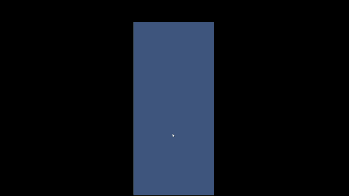

# Matchtoria

A match-3 puzzle prototype built with **C# and Unity** as a **two-person Dream Games case-study project**. Players swap tiles, clear obstacles and use special tiles to complete level objectives within a limited number of moves.

The project focuses on gameplay class responsibilities: board, tile and level objects hold game state and rules, while timestamped commands connect board resolution to animation playback.

<p align="center">
  
</p>

The demo shows Dream Games visual assets. The original sprite assets are excluded from this public repository.

**Built with:** C#, Unity 6, Universal Render Pipeline, DOTween and Newtonsoft JSON.

## Gameplay

- Match detection, cascading matches, obstacle-aware falling and board refills.
- Rocket, TNT and ColorBomb behavior, alongside box, vase and stone obstacles with their own damage rules.
- JSON-defined levels with board layouts, move limits and objectives.
- Level selection, saved progress and win/lose screens.
- Tile object pooling for reuse of view objects.

## Architecture

The gameplay model applies **Domain-Driven Design (DDD) principles**: classes represent game concepts and contain behavior as well as state. Model / Command / View describes the presentation split; the design also addresses which class should own each gameplay rule.

- **Gameplay responsibilities:** tile classes decide how they respond to damage and triggering. `Level` owns move counts, objective updates and win/lose decisions, rather than leaving those rules to the UI.
- **Tile capabilities:** `IMatchable`, `IMovable`, `IDamageable` and `ITriggerable` describe what each tile can do. Matching, falling and damage code operate on these gameplay objects.
- **Board resolution:** `BoardModel` coordinates swaps and cascades with `MatchManager` and `FallManager`. The model produces commands describing the resulting movements and effects.
- **Animation playback:** `BoardView` sorts commands by timestamp and schedules them in a DOTween `Sequence`. `BoardManager` connects player input to the model and supplies timed callbacks so objective updates align with tile destruction.

The main interaction flow is:

```text
Player input
  -> BoardManager
  -> BoardModel.ProcessSwap
  -> Timestamped commands
  -> BoardView.ExecuteCommands
  -> DOTween animation and timed callbacks
```

Gameplay resolution is separate from scene objects and tween playback, but **the model is not fully independent of Unity**. It still uses Unity types and utilities, and its command timing references animation constants. Overlapping animations in a sequence do not imply background-thread execution.

### Code starting points

| File | Responsibility |
| --- | --- |
| [BoardModel.cs](Assets/Scripts/Models/BoardModel.cs) | Swaps, cascades and command generation |
| [NodeModel.cs](Assets/Scripts/Models/Nodes/NodeModel.cs) | Layered board cells and tile interactions |
| [Matchable.cs](Assets/Scripts/Models/Tiles/Matchable.cs) | Tile capabilities and source-dependent damage rules |
| [Level.cs](Assets/Scripts/Level/Level.cs) | Objectives, move counts and win/lose decisions |
| [BoardView.cs](Assets/Scripts/Views/BoardView.cs) | Timed command playback and animation |
| [LevelSceneManager.cs](Assets/Scripts/Managers/LevelSceneManager.cs) | Construction and event wiring of level systems |

## Running locally

The current editor version is **Unity 6000.6.4f1**, recorded in [ProjectVersion.txt](ProjectSettings/ProjectVersion.txt). The package manifest currently specifies **URP 17.6.0**; see [Packages/manifest.json](Packages/manifest.json) for the complete package list. DOTween is included under [Assets/DOTween](Assets/DOTween).

1. Clone the repository and open it through Unity Hub using the recorded editor version.
2. Let Unity import the project and resolve its packages.
3. Supply the required sprite assets and repair missing scene/prefab references. The public checkout omits the original Dream Games sprites, so it is not a complete visual-asset bundle.
4. Open `Assets/Scenes/Bootstrap.unity` and enter Play mode after resolving dependencies and missing references.

The normal scene flow is `Bootstrap -> MainMenuScene -> LevelScene`. A separate `TestScene` and runtime experiment scripts are also included.

## Tests

[Tests/PureLogic](Tests/PureLogic) contains a **.NET 8 / NUnit** test project with tests for swaps, matching, falling, damage, cascade timing and tile creation. It links selected gameplay source files from `Assets/Scripts`.

The tests use the .NET test runner rather than Unity's test runner, but they **still reference Unity managed assemblies**. Install the .NET 8 SDK and ensure `UnityManaged` points to the directory containing `UnityEngine.dll` and `UnityEngine.CoreModule.dll`.

From the repository root:

```sh
dotnet test Tests/PureLogic/DreamGamesCase.PureLogic.Tests.csproj
```

The [test project file](Tests/PureLogic/DreamGamesCase.PureLogic.Tests.csproj) defaults to the Windows Unity Hub installation path for `6000.6.4f1`. For a different installation, pass `-p:UnityManaged="<path-to-UnityEngine-managed-directory>"` to the command above.

The components in `Assets/Scripts/Tests` are separate runtime experiments, not the standalone NUnit suite.

## Current scope

This is a prototype. Special-tile combination logic exists in the model, but the current view skips `Merge` commands, so swapping two special tiles together is unfinished. This is distinct from triggering special tiles through damage.

## Credits

Developed as a **two-person project**.

**My main contribution** was defining gameplay class responsibilities and deciding which behaviors should belong to which domain classes. The architecture description covers the collaborative project as a whole, not individual authorship of every mechanism.

The sprites and other visual assets shown in the demo belong to **Dream Games**. They are not original artwork by the project contributors; the original sprites are omitted from this public checkout.
